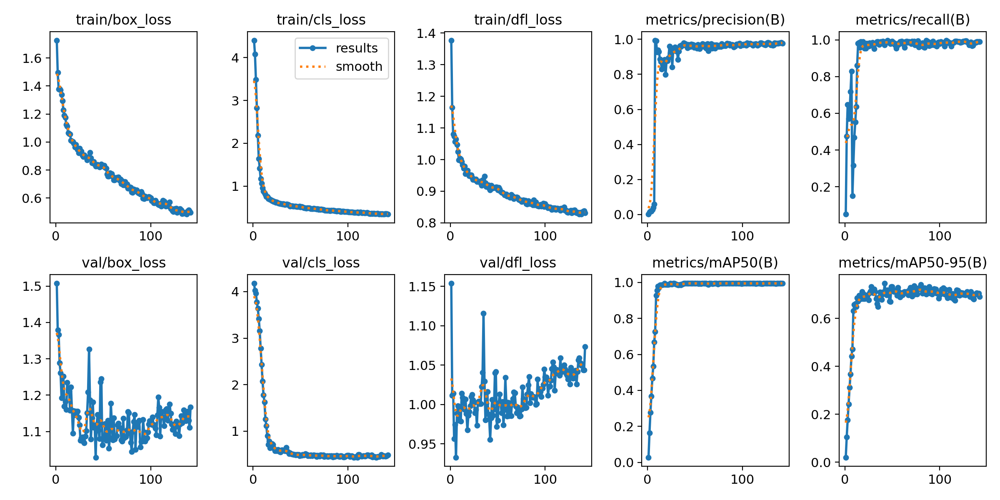

# YOLO11 Ultralitics
Это простой пример как использовать YOLO из пакета Ultralitics
В этом примере рассмотрен вариант обучения нейросети YOLO при нехватке обучающих данных.
исходные данные для обучения [https://disk.yandex.ru/d/-VhiX2BOWdw-rg]

## Установка зависимостей
Загрузка docker:
```
docker pull ultralytics/ultralytics:latest
```
Установка python modules:
```
pip3 install -r requirements.txt
```

## Подготовка dataset
Видео были разбиты на отдельные кадры с определенных шагом от 1 до 3 сек на кадр.

```
ffmpeg -i 2_1.MOV -vf "fps=1" -start_number 1 2_1-%04d.png
```
разбивал сначала на png файлы
затем преобразовыввал в jpg с нужным качеством сжатия
```
mogrify -format jpg -quality 95 *.png
```

далее кадры были отобранны вручную, были удалены одинаковые кадры.
Так как данных мало, то разбиение на train и val производилось вручную (по 1-2 кадра с каждой сцены).
исходные датасет представлен в виде структуры:</br>
```
source_dataset/
├── images/
│   ├── train/
│   │   ├── img1.jpg
│   │   └── ...
│   └─── val/
│       ├── img2.jpg
│       └── ...
└─── labels/
    ├── train/
    │   ├── img1.txt    labels in YOLO format (class x_center y_center width height)
    │   └── ...
    └─── val/
        ├── img2.txt
        └── ...
```

### Разметка
Для представленного набора видео были выбраны следующие классы:
  - bbq
  - greek-salat
  - soup
  - cap-empty
  - cap-full
  - plate-trash
  - tableware
  - teapod
  - saucer
  - shot
  - trash

Классы перечислены в файле: **source_dataset/data.yaml** </br>
Разметку производил с помощью небольшой утилилиты написанной мною ранее **tools/make_labels.py**</br>
Перед запуском утилиты создадим список изображений, которые необхоидимо разметить
```
find $PWD/source_dataset -name "*.jpg" > data.txt
```
запускаем утилиту
```
tools/make_labels.py --list data.txt --class 0
```
Размечаем только выбранный класс (в примере класс под номером: 0) на всех изображениях.</br>
Далее запускаем утилиту для следующего класса и так далее пока не разметим все объекты.</br>
Переносим файлы разметки (.txt) в директорию labels</br>

### Аугментация
Аугментацию можно производить средствами ultralitics.
Но мы будем выполнять отдельно, это позволить контролировать изменение разметки и при необходимости можно подправить разметку.
Аугментацию будем прозводить с помощью утилиты **tools/augmentation.py**
выполните команду, чтобы выполнить аугментацию с параметрами заданными в этом bash скрипте
```
./augmentation.sh
```
новые данные появятся в директории datasets.</br>
PS: если у вас не хватает памяти во время исполнения аугментации, потому что она выполняется параллельно на нескольких ядрах CPU, то в скрипте **tools/augmentation.py** уменьшите параметр cpu_count() в строке ```with Pool(processes=cpu_count()-1) as pool:``` например так: ```with Pool(processes=1) as pool:```


## Обучение
Запустите обучение командой 
```
./train.sh
```
гиперпараметры заданы в bash скрипте

В репозитории представленны результаты обучения:</br>
```
result/
├── train  (10  epoch, 640x640)
├── train2 (100 epoch, 640x640)
├── train3 (100 epoch, предварительная аугментация, включена дефалтная аументация в ultralitics, batch=16, 360x640)
├── train4 (100 epoch, предварительная аугментация, включена дефалтная аументация в ultralitics, batch=32, 360x640)
├── train5 (100 epoch, предварительная аугментация, batch=32, 360x640)
├── train6 (100 epoch, предварительная аугментация, batch=32, 384x640)
```
Если размер памяти GPU позволяет увеличить размер batch то стоит это сделать, так нейросеть лучше обобщает и лучше учится.
Для ускорения обучения и инференса лучше использовать размер сети соотвествующий размеру видео (хотя бы соотношение сторон)


### Выводы

* более 100 эпох делать нет смысла начинается переобучение 
* mAP50-95 достаточно высокий, это хорошо, но есть куда еще расти
* val/dfl_loss и val/box_loss имеют высокое знаение, что плохо, возможно из за того что мало данных в выборке val и каждая ошибка дает существенный вклад в общий результат
* прозрачные объекты обнаруживает хуже
* объекты со слабо выраженной структурой типа мусора сложно определять
* прозрачные объекты небольшого размера (стопка, блюдце) определят хуже всего
* если размечать составные объекты (чашка с блюдцем) то в результате когда они стоят по отдельности нейросеть может путать эти объекты

## Predict (применение)
Для генерации видео с детекцией объектов выполните команду:
```
python3 tools/predict.py   --weights=result/train6/weights/best.pt   --input 4_1.MOV   --output 4_1.mp4   --imgsz 384 640   --conf 0.2   --codec mp4v
```


